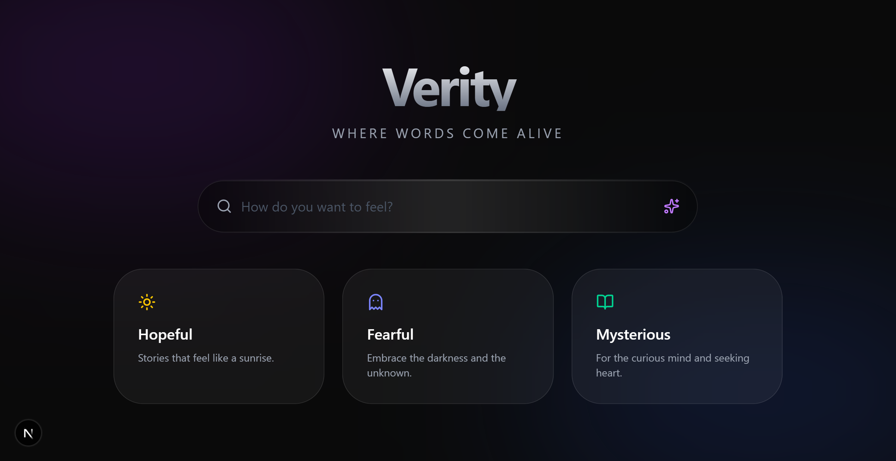

# 🌌 Verity | The Future of Immersive Reading

**Verity** is a  reading platform that abandons rigid book genres for **AI-driven emotional filters**. It transforms the digital reading experience into a multisensory journey using reactive shaders and tactile UI materials.

---

## 🚀 The Vision
We don't just read stories; we inhabit them. Verity uses NLP to map the "emotional DNA" of a book and translates it into a dynamic visual environment. 

- **Beyond Genres:** Instead of "Horror," search for "0.8 Fear / 0.2 Mystery."
- **Reactive Backgrounds:** WebGL shaders that move and change color based on the book's sentiment.
- **Liquid Glass UI:** A tactile, frosted-glass interface designed for high focus and low cognitive load.

## 🛠 Tech Stack 
- **Frontend:** Next.js 15, TypeScript, Tailwind CSS
- **Graphics:** Three.js / React Three Fiber (GLSL Shaders)
- **Backend:** Node.js, Express, MongoDB (MERN)
- **AI/NLP:** LangChain + OpenAI GPT-4o (Sentiment Mapping)
- **Deployment:** Vercel (Web) & Railway (API)

## 📁 Repository Structure
- `apps/web`: Next.js frontend with GLSL integration.
- `apps/server`: Express API for book metadata and mood analysis.
- `packages/ui`: Shared design system (Liquid Glass components).
- `packages/vibe-engine`: Core logic for sentiment-to-color mapping.

## 🚧 Roadmap
- [ ] Phase 1: Architecture & Brand Identity (Current)
- [ ] Phase 2: The "Vibe" Engine (Sentiment Analysis)
- [ ] Phase 3: Reactive Shader Environments
- [ ] Phase 4: Project Gutenberg API Integration

## 📄 License
This project is licensed under the MIT License.